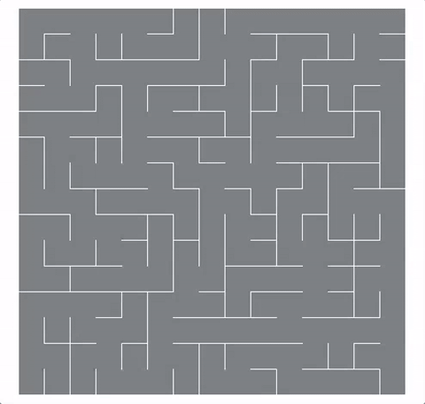

# Maze Generation Algorithms

- [X] Depth First Search + Backtracking
- [X] Randomized Kruskal's Algorithm
- [ ] Randomized Prim's Algorithm
- [ ] Recursive Division Method
- [ ] Cellular Automaton

_A maze generated with a randomized version of Krusal's algorithm._
